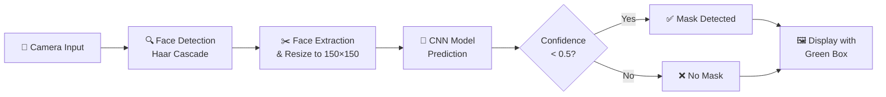

<p align="center">
  
  
  
  
  
  
</p>

<h1 align="center">😷 Face Mask Detection using Deep Learning</h1>

<p align="center">
  <b>A real-time face mask detection system powered by a Convolutional Neural Network (CNN) and deployed as an interactive Streamlit web application.</b>
</p>

<p align="center">
  <a href="#-features">Features</a> •
  <a href="#-demo">Demo</a> •
  <a href="#-model-architecture">Architecture</a> •
  <a href="#-dataset">Dataset</a> •
  <a href="#-results">Results</a> •
  <a href="#-installation">Installation</a> •
  <a href="#-usage">Usage</a> •
  <a href="#-tech-stack">Tech Stack</a>
</p>

---

## ✨ Features

- 🎥 **Real-Time Detection** — Uses your webcam to instantly detect face masks via a browser-based camera input
- 🧠 **Deep Learning CNN** — Custom-built 3-layer Convolutional Neural Network trained from scratch
- 🖼️ **Data Augmentation** — Rotation, zoom, and horizontal flip for robust generalization
- 📦 **One-Click Deployment** — Streamlit-powered web app with zero frontend code
- 🔍 **Face Localization** — Haar Cascade classifier detects faces before classification
- ⚡ **Cached Inference** — Model & cascade loaded once using `@st.cache_resource` for blazing-fast predictions

---

## 🎬 Demo

> **How it works:** Open the app → Allow camera access → Take a photo → Get instant mask/no-mask prediction with bounding boxes!

```
✅ Mask Detected    → Green bounding box
❌ No Mask          → Red bounding box
⚠️ No Face Detected → Warning alert
```

---

## 🧠 Model Architecture

The CNN follows a classic feature extraction → classification pipeline:

```
Input Image (150×150×3)
        │
        ▼
┌─────────────────────┐
│  Conv2D (32 filters) │  ← 3×3 kernel, ReLU activation
│  MaxPooling2D (2×2)  │
├─────────────────────┤
│  Conv2D (64 filters) │  ← 3×3 kernel, ReLU activation
│  MaxPooling2D (2×2)  │
├─────────────────────┤
│  Conv2D (128 filters)│  ← 3×3 kernel, ReLU activation
│  MaxPooling2D (2×2)  │
├─────────────────────┤
│      Flatten         │  ← Convert to 1D vector
├─────────────────────┤
│   Dense (128 units)  │  ← ReLU activation
│   Dropout (0.5)      │  ← Regularization
├─────────────────────┤
│   Dense (1 unit)     │  ← Sigmoid → Binary output
└─────────────────────┘
        │
        ▼
  Mask (< 0.5) / No Mask (≥ 0.5)
```

| Component | Details |
|-----------|---------|
| **Optimizer** | Adam |
| **Loss Function** | Binary Crossentropy |
| **Metric** | Accuracy |
| **Input Size** | 150 × 150 × 3 (RGB) |
| **Output** | Sigmoid (Binary: Mask / No Mask) |

---

## 📊 Dataset

The dataset contains **7,585 face images** organized into two classes:

| Class | Images | Description |
|-------|--------|-------------|
| 😷 `with_mask` | 3,725 | Faces wearing various types of masks |
| 😶 `without_mask` | 3,828 | Faces without masks |

**Data Split:**
- **Training Set:** 6,069 images (80%)
- **Validation Set:** 1,516 images (20%)

**Augmentation Applied:**
- 🔄 Rotation: ±20°
- 🔍 Zoom: 20%
- ↔️ Horizontal Flip

```
data/
├── with_mask/          # 3,725 images
└── without_mask/       # 3,828 images
```

---

## 📈 Results

| Metric | Value |
|--------|-------|
| **Training Accuracy** | ~82.76% |
| **Validation Accuracy** | **~90.77%** |
| **Training Loss** | 0.3949 |
| **Validation Loss** | 0.2359 |
| **Epochs Trained** | 1 |

> 💡 **Note:** The model achieved **90.77% validation accuracy in just 1 epoch!** Performance can be further improved by training for more epochs.

---

## 🚀 Installation

### Prerequisites

- Python 3.10 or higher
- pip (Python package manager)
- Webcam (for real-time detection)

### Steps

**1. Clone the repository**

```bash
git clone https://github.com/tafrusaidev/Face-Mask-Detection-Model.git
cd Face-Mask-Detection-Model
```

**2. Create a virtual environment (recommended)**

```bash
python -m venv venv
# Windows
venv\Scripts\activate
# macOS/Linux
source venv/bin/activate
```

**3. Install dependencies**

```bash
pip install -r requirements.txt
```

---

## 🎮 Usage

### Run the Streamlit Web App

```bash
streamlit run app.py
```

The app will open in your default browser at `http://localhost:8501`. Allow camera access, take a photo, and see the prediction!

### Train the Model (Optional)

Open the Jupyter notebook to retrain or modify the model:

```bash
jupyter notebook face_mask_detection_using_DL.ipynb
```

> **Tip:** The notebook was originally developed on Google Colab with GPU (T4) acceleration. You can [open it directly in Colab](https://colab.research.google.com/) for faster training.

---

## 🛠️ Tech Stack

<table>
  <tr>
    <td align="center" width="120">
      
      <br><b>TensorFlow</b>
      <br><sub>Model Training</sub>
    </td>
    <td align="center" width="120">
      
      <br><b>Keras</b>
      <br><sub>CNN Architecture</sub>
    </td>
    <td align="center" width="120">
      
      <br><b>OpenCV</b>
      <br><sub>Face Detection</sub>
    </td>
    <td align="center" width="120">
      
      <br><b>NumPy</b>
      <br><sub>Data Processing</sub>
    </td>
    <td align="center" width="120">
      
      <br><b>Streamlit</b>
      <br><sub>Web App</sub>
    </td>
  </tr>
</table>

---

## 📁 Project Structure

```
Face-Mask-Detection-Model/
│
├── app.py                               # Streamlit web application
├── face_mask_detection_using_DL.ipynb   # Model training notebook
├── face_mask_model.h5                   # Pre-trained CNN model (~55 MB)
├── requirements.txt                     # Python dependencies
├── .gitignore                           # Git ignore rules
│
└── data/
    ├── with_mask/                       # 3,725 masked face images
    └── without_mask/                    # 3,828 unmasked face images
```

---

## 🔧 How It Works



1. **Capture** — Streamlit captures an image from your webcam
2. **Detect** — OpenCV's Haar Cascade locates faces in the frame
3. **Preprocess** — Each detected face is cropped, resized to 150×150, and normalized
4. **Predict** — The CNN model classifies each face as "Mask" or "No Mask"
5. **Display** — Results are shown with color-coded bounding boxes and labels

---

## 🤝 Contributing

Contributions are welcome! Here's how you can help:

1. 🍴 **Fork** the repository
2. 🌿 **Create** a feature branch (`git checkout -b feature/amazing-feature`)
3. 💾 **Commit** your changes (`git commit -m 'Add amazing feature'`)
4. 📤 **Push** to the branch (`git push origin feature/amazing-feature`)
5. 🔃 **Open** a Pull Request

---

## 📜 License

This project is open source and available under the [MIT License](LICENSE).

---

## 🙏 Acknowledgements

- Dataset sourced from publicly available face mask image datasets
- [Haar Cascade Classifier](https://docs.opencv.org/3.4/db/d28/tutorial_cascade_classifier.html) by OpenCV for face detection
- [Streamlit](https://streamlit.io/) for the rapid web app framework
- Trained using [Google Colab](https://colab.research.google.com/) with T4 GPU acceleration

---

<p align="center">
  <b>⭐ If you found this project useful, please consider giving it a star!</b>
</p>

<p align="center">
  Made with ❤️ by <a href="https://github.com/tafrusaidev">tafrusaidev</a>
</p>
